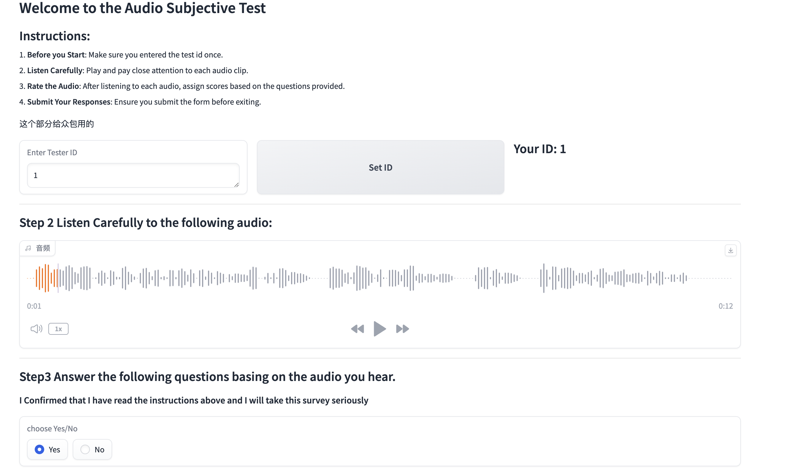
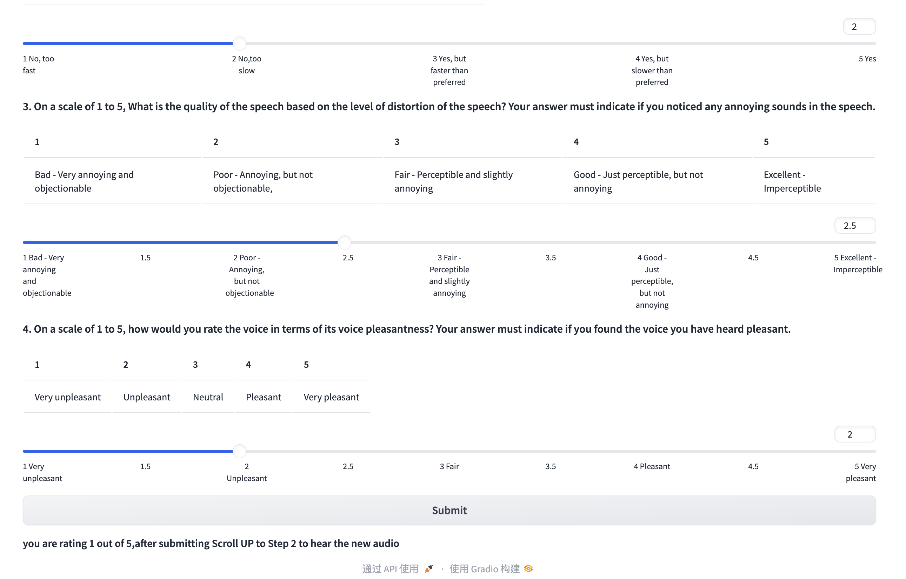

#### MOS_Test

* Built with Gradio, user-friendly and 100% python, so it is easy to design your own TEST within seconds
* Design for crowdsource platform
* install requirements lib and then you are free to go : )
* Higher version Gradio might ran into problems with safari (audio cannot be played) , if so, use the gradio lib suggested in requirements.txt
* 

* 